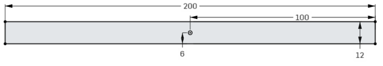
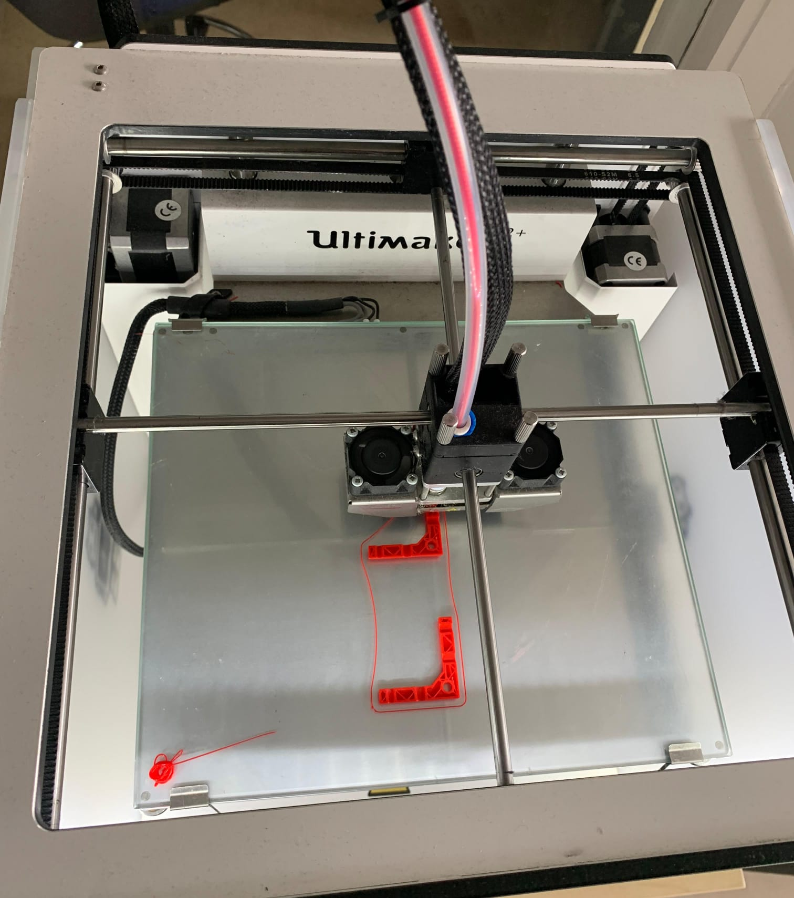
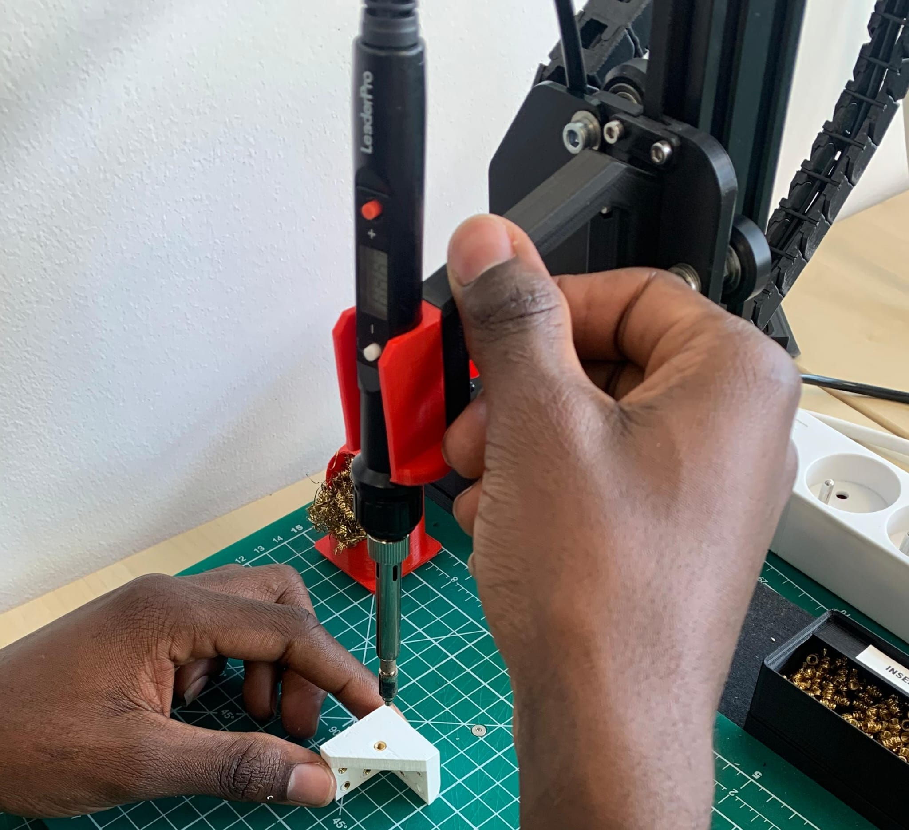

# Conception et prototypage
## I. **Conception de la maquette**
### Modèle 3D de la plaforme de jeu 
Le plateau final devra avoir la forme ci-dessous avec un base de 200x200 mm, une face de dessus de 160x200 mm pour une hauteur de 120 mm.  
<html lang="en">
  <head>
    <title>&lt;model-viewer&gt; template</title>
    <meta charset="utf-8">
    <meta name="description" content="&lt;model-viewer&gt; template">
    <meta name="viewport" content="width=device-width, initial-scale=1">
    <link type="text/css" href="./images/Model/styles.css" rel="stylesheet"/>
  </head>
  <body>
    <!-- <model-viewer> HTML element -->
    <model-viewer id="viewer" src="images/Model/Part_Studio_Frontiera.gltf" ar ar-modes="webxr scene-viewer quick-look" camera-controls tone-mapping="commerce" poster="images/Model/poster.png" shadow-intensity="1" auto-rotate camera-target="0m 0m 0m">
      

          

      

      <button slot="ar-button" id="ar-button">
          View in your space
      </button>
      

          
      

    </model-viewer>  
    
    <!-- Loads <model-viewer> for browsers: -->
    
  </body>
</html>

 
#### Dimenssionement du plateau
Afin de gagner du temps et de réduire les coûts des matériaux, l'impression 3D ne sera pas utilisée pour l'ensemble de la maquette. Seules les faces supérieures et inférieures seront imprimées en 3D pour une épaisseur de 3 mm, ainsi que des petites pièces permettant de joindre chaque face entre elles pour obtenir la maquette finale. Les faces lattérales seront réalisées à partir de plaques de bois d'une épaisseur de 3 mm.

#### 1. Les faces lattérals
Toutes les faces latérales en plaque de bois devront être découpées au laser, avec des trous de 3 mm de diamètre pour faciliter la visse.

    

        
        
 les faces lattérals du plateau de jeu

    
    

#### 1.1 La faces de droite

#### 1.2 La faces de gauche

#### 1.3 La face arrière

    

        
        
La face arrière

    

    

        
        
La face arrière

    

    

#### 1.4 La face avant
Celle-ci sera composée de trois plaques de bois jointes entre elles en fonction de la hauteur de la maquette, avec une inclinaison de 157,034° par rapport aux deux autres.
#### 1.4.1 La plaque supérieure

    

        
        
Plaque_supérieure

    

    

        
        
Plaque_supérieure

    

    

#### 1.4.2 la plaque intermédiaire

    

        
        
la plaque intermédiaire

    

    

        
        
la plaque intermédiaire

    

    

#### 1.4.3 La plaque inférieure

#### 2. Les jointures
Les jointures seront effectuées en utilisant une impression 3D, puis nous y ajouterons des inserts qui nous permettront d'associer les différentes faces entre elles.
#### 2.1 Les 4 jointures arrière
Quatre d'entre elles seront imprimées et permettront d'associer les plaques de gauche, de droite, de l'arrière, du  dessus et de la base du plateau.

#### 2.2 Les jointures avant
#### 2.2.1 Les jointures supérieures
On imprimera deux d'entre elles qui permettront de combiner les plaques de gauche, de droite, du dessus et de la plaque avant supérieure.

#### 2.2.2 Les jointures intermédiaires
Chacune sera imprimée au nombre de deux et permettra de relier la plaque intermédiaire qui portera l'écran aux deux plaques supérieures et inférieurs.

    

        
        
Jointure reliant les plaques supérieure et intermédiaire 

    

    

        
        
Jointure reliant les plaques intermédiaire et inférieure

    

    

#### 2.2.2 Les jointures inférieures
On imprimera deux d'entre elles qui permettront de combiner les plaques de gauche, de droite, de la base du plateau et de la plaque avant inférieure.

#### 2.3 Impression et ajout des inserts

    

        
        
 Impression en 3D des jointures

    

    

        
        
 Ajout des inserts

    

    

### Support en forme de matrice pour les neopixels
<html lang="en">
  <head>
    <title>&lt;model-viewer&gt; template</title>
    <meta charset="utf-8">
    <meta name="description" content="&lt;model-viewer&gt; template">
    <meta name="viewport" content="width=device-width, initial-scale=1">
    <link type="text/css" href="./images/Model_matrice/styles.css" rel="stylesheet"/>
  </head>
  <body>
    <!-- <model-viewer> HTML element -->
    <model-viewer id="viewer" src="images/Model_matrice/Part_Studio_matrice.gltf" ar ar-modes="webxr scene-viewer quick-look" camera-controls tone-mapping="commerce" poster="images/Model_matrice/poster.png" shadow-intensity="1" auto-rotate>
      

          

      

      <button slot="ar-button" id="ar-button">
          View in your space
      </button>
      

          
      

    </model-viewer>  
    
    <!-- Loads <model-viewer> for browsers: -->
    
  </body>
</html>

## II. Pototypage
### A. Test de communication entre les LEDs neopixels et le µPC ESP32

