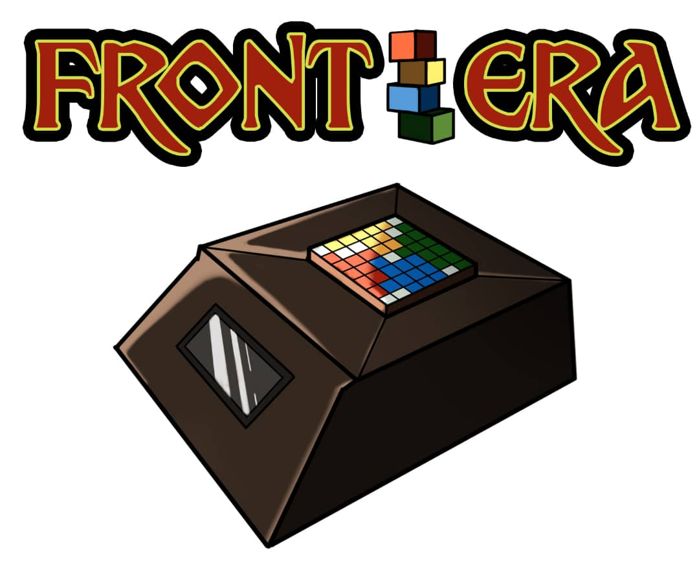
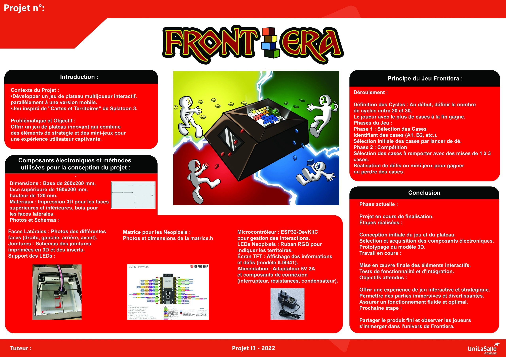

# Bienvenue sur notre documentation

Le projet Frontiera sera réalisé en deux versions: physique et mobile. Ce site présentera le fonctionnement de la version physique.  

## À propos du Projet
Le jeu consiste à conquérir le plus de territoires grâce à des défis interactifs. A chaque tour, un joueur reçoit un défi, le principe : il met en jeu un nombre de cases territoire.  

• S'il réussit le défi, il gagne le double des cases qu'il a mises en jeu.  
• S'il échoue, il perd les cases mises en jeu.  

Après avoir terminé le défi, c'est la fin du tour. Lorsque le nombre de cycles de la partie défini au début du jeu entre le joueur est atteint, la partie se termine ou il ne reste qu'un seul joueur sur le plateau. 

## Poster

## Vidéo

Présentation du projet :

<video src="images/Présentation_Frontièra.mov" controls title="Présentation de Frontiera"  style="width: 100%;"></video>

---
