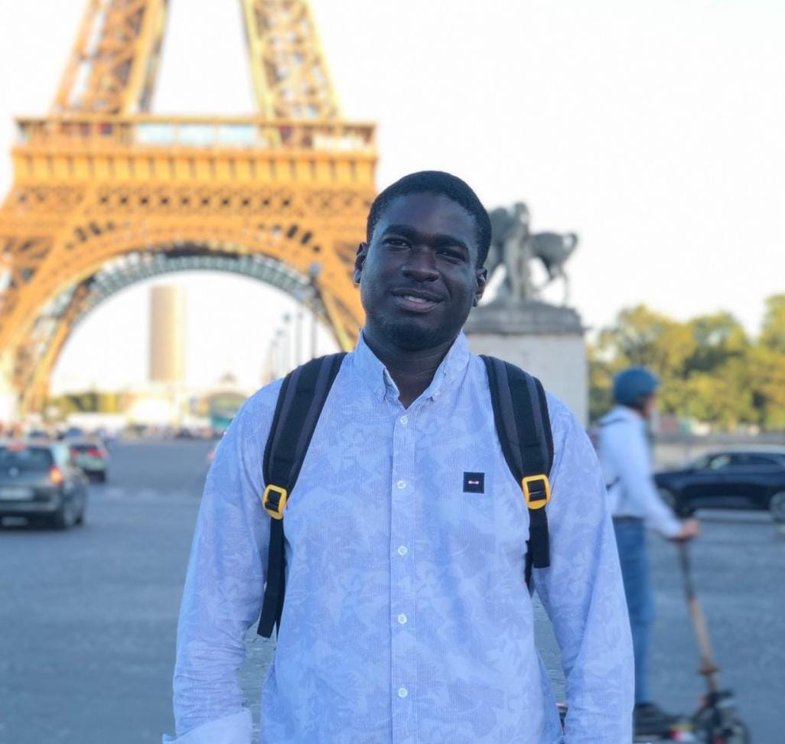
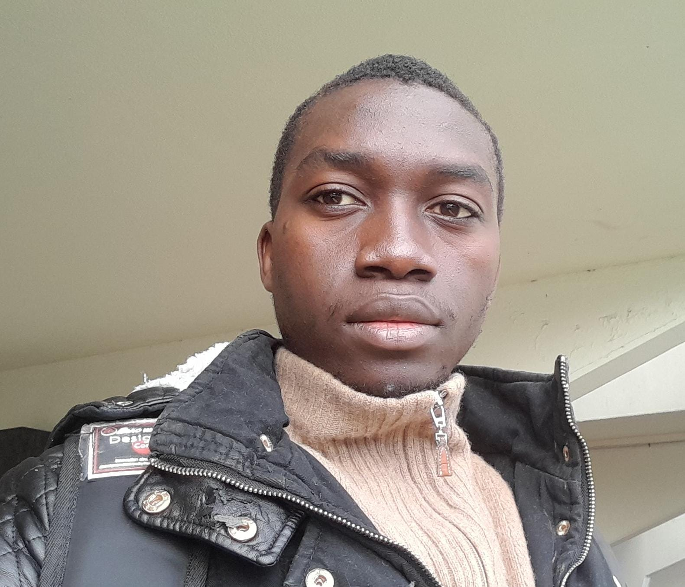
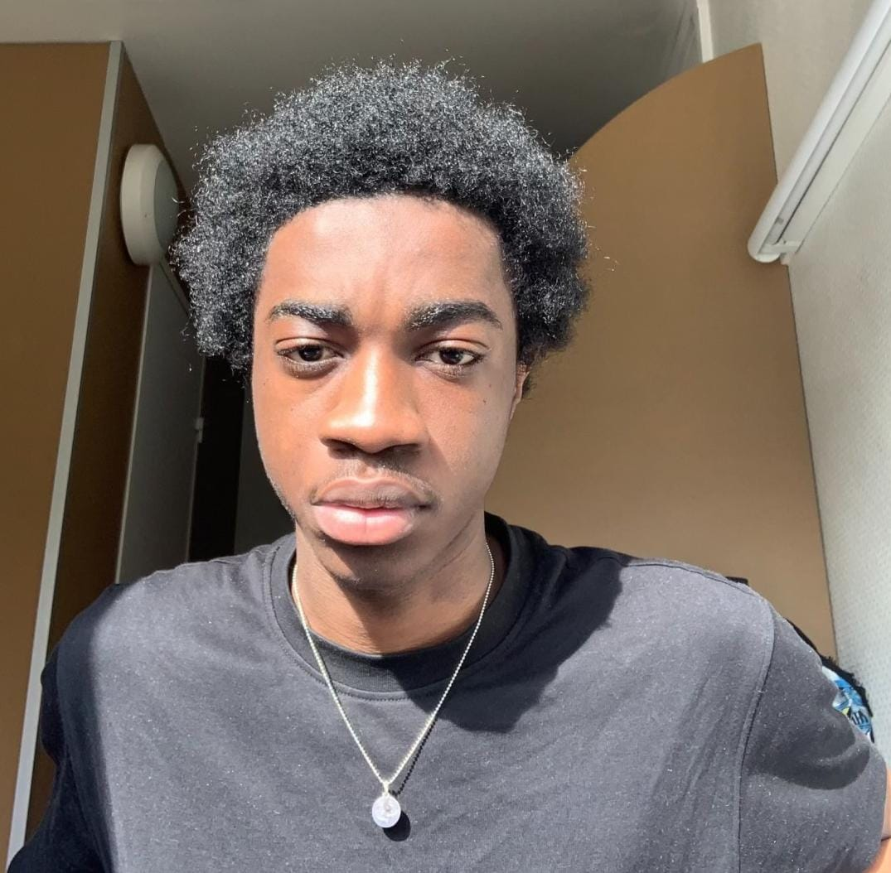

# Présentation de l'équipe

    

        
        
Allioune FALL

    

    

        
        
Daryl FOTSING

    

    

        
        
Yanis MIHINDOU MIHINDOU

    

Nous formons un groupe de trois étudiants à UniLaSalle Amiens, qui étudient l'ingénierie en 3e année. Cette année, nous sommes tenus de réaliser un projet de groupe. Nous viserons à créer un jeu de société qui permettra d'interagir 2 à 4 joueurs.

### Matrice des compétences

|/| Programmation | Modélisation 3D | Assemblage |Circuit éléctronique|
|:-:|:--:|:---:|:--:|:---:|
| **FALL Allioune** | 4 | 3| 4 |4|
| **FOTSING Daryl** | 3 | 5 | 4|4|
| **MIHINDOU MIHINDOU Yanis** | 5 | 3 | 4 |4|

### Division des tâches et des responsabilités:
- *Daryl* est en charge de la modélisation 3D.
- *Fall* est en charge de la conception du circuit électronique.
- *Yanis* est en charge de la programmation.
